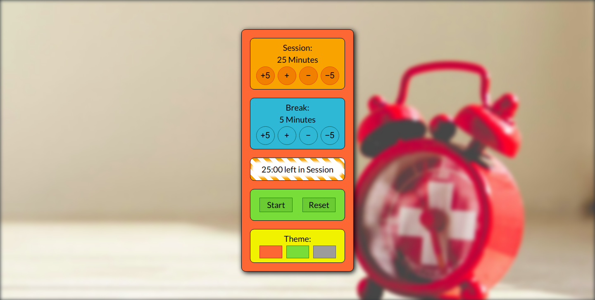

# Pomodoro Clock

## Introduction
The page shows a pomodoro clock with settings for break and work timers. When the work timer runs out the application plays a sound and switches to the break timer and keeps on repeating this process. Three color schemes are available.

The site is build in React utilizing Create-React-App.

This project is part of freeCodeCamps Frontend Libraries certificate.

## Project Requirements
* There is an element with id="break-label" that contains a string (e.g. "Break Length").
* There is an element with id="session-label" that contains a string (e.g. "Session Length").
* There are two clickable elements with corresponding IDs: id="break-decrement" and id="session-decrement".
* There are two clickable elements with corresponding IDs: id="break-increment" and id="session-increment".
* There is an element with a corresponding id="break-length", which by default (on load) displays a value of 5.
* There is an element with a corresponding id="session-length", which by default displays a value of 25.
* There is an element with a corresponding id="timer-label", that contains a string indicating a session is initialized (e.g. "Session").
* There is an element with corresponding id="time-left". NOTE: Paused or running, the value in this field should always be displayed in mm:ss format (i.e. 25:00).
* There is a clickable element with a corresponding id="start_stop".
* There is a clickable element with a corresponding id="reset".
* Clicking the element with the id of reset, any running timer should be stopped, the value within id="break-length" should return to 5, the value within id="session-length" should return to 25, and the element with id="time-left" should reset to it's default state.
* Clicking the element with the id of break-decrement, the value within id="break-length" decrements by a value of 1, and the updated value is displayed.
* Clicking the element with the id of break-increment, the value within id="break-length" increments by a value of 1, and the updated value is displayed.
* Clicking the element with the id of session-decrement, the value within id="session-length" decrements by a value of 1, and the updated value is displayed.
* Clicking the element with the id of session-increment, the value within id="session-length" increments by a value of 1, and the updated value is displayed.
* A session or break length has to stay above 0.
* A session or break length has to stay below 61.
* Clicking the element with id="start_stop", the timer should begin running from the value currently displayed in id="session-length", even if the value has been incremented or decremented from the original value of 25.
* If the timer is running, the element with the id of time-left should display the remaining time in mm:ss format (decrementing by a value of 1 and updating the display every 1000ms).
* If the timer is running and the element with id="start_stop" is clicked, the countdown should pause.
* If the timer is paused and the element with id="start_stop" is clicked, the countdown should resume running from the point at which it was paused.
* When a session countdown reaches zero (NOTE: timer MUST reach 00:00), and a new countdown begins, the element with the id of timer-label should display a string indicating a break has begun.
* When a session countdown reaches zero (NOTE: timer MUST reach 00:00), a new break countdown should begin, counting down from the value currently displayed in the id="break-length" element.
* When a break countdown reaches zero (NOTE: timer MUST reach 00:00), and a new countdown begins, the element with the id of timer-label should display a string indicating a session has begun.
* When a break countdown reaches zero (NOTE: timer MUST reach 00:00), a new session countdown should begin, counting down from the value currently displayed in the id="session-length" element.
* When a countdown reaches zero (NOTE: timer MUST reach 00:00), a sound indicating that time is up should play. This should utilize an HTML5 audio tag and have a corresponding id="beep".
* The audio element with id="beep" must be 1 second or longer.
* The audio element with id of beep must stop playing and be rewound to the beginning when the element with the id of reset is clicked.

## Project Data
Timer sound:  
https://goo.gl/65cBl1

## Final Project
https://myrmidonut.github.io/fcc_frontend_pomodoro_clock

## Preview Images
### Main Screen:

